# Praktikum 3
## Latihan 1
### Penggunaan End
#### - Pengunaan end pada Python berfungsi untuk memberi parameter (pemisah) antara quotes yang kita buat 
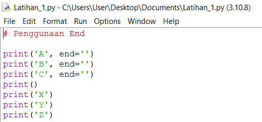
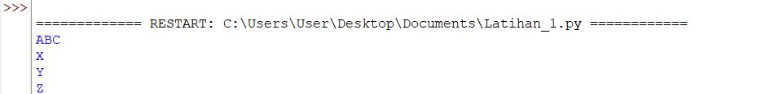
## Pengunaan Separator
#### - Pengunaan separator pada Python berfungsi sebagai pemisah setiap variabel yang telah diberi nilai 
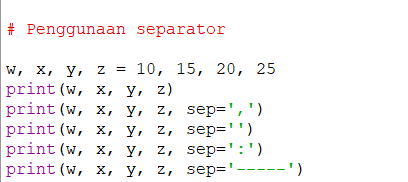
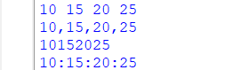
## String Format
#### - String Formatting atau Pemformatan string memungkinkan kita menyuntikkan item ke dalam string daripada kita mencoba menggabungkan string menggunakan koma atau string concatenation.
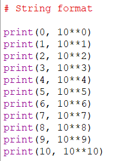
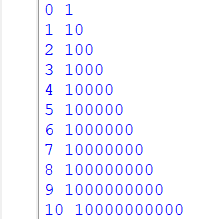
#### - Ini adalah contoh string concatenation
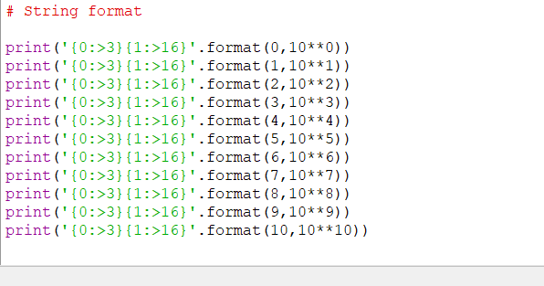
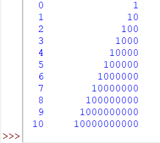
#### - Ini adalah contoh string formatting
#### - Ada tiga cara untuk melakukan peformatan string
##### - Metode lama menggunakan placeholder menggunakan karakter '%'(modulo)'
##### - Teknik yang diingatkan menggunakan metode string .format()
##### - Metode terbaru, diperkenalkan dengan Python 3.6, menggunakan string literal yang diformat, disebut *f-string*
## Latihan 2 
#### - Tentukan variabel terlebih dahulu, saya memakai dua variabel, yaitu a dan b
#### - Beri inputan pada variabel
#### - Setelah diberi input, ekspresikan variabel yang telah diberi inputan
#### - Lalu kita mencoba menggabungkan variabel a dan b dengan *Formatting String*
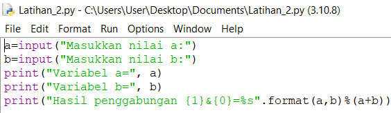
### Konversi nilai variabel
#### - Konversi nilai variabel yang masih berbentuk 'string' pada 'intreger'
#### - Setelah itu menjumlahkan dan membagi dengan mengepresikan dalam bentuk *Formatting String*
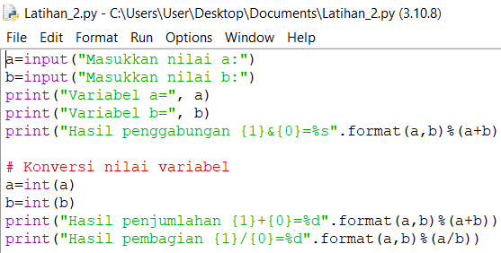
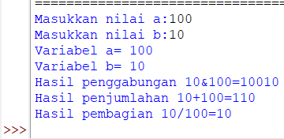
## Latihan 3
### Buatlah kode program menggunakan string formattting untuk menghasilkan output seperti gambar dibawah ini
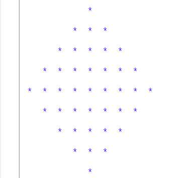
```
print('{0:>11}'.format(" * ")
print('{0:>13}'.format(" * * * ")
print('{0:>14}'.format(" * * * * * ")
print('{0:>16}'.format(" * * * * * * * ")
print('{0:>17}'.format(" * * * * * * * * * ")
print('{0:>16}'.format(" * * * * * * * ")
print('{0:>14}'.format(" * * * * * ")
print('{0:>12}'.format(" * * * ")
print('{0:>11}'.format(" * ")
```
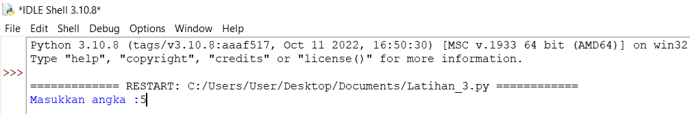
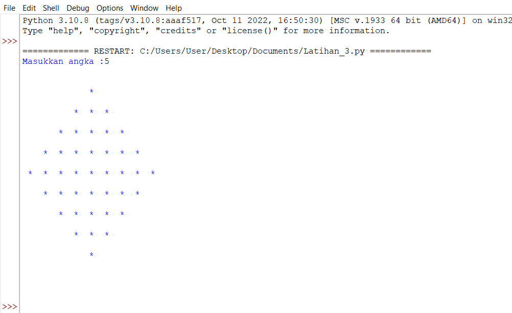
## Praktikum 3 
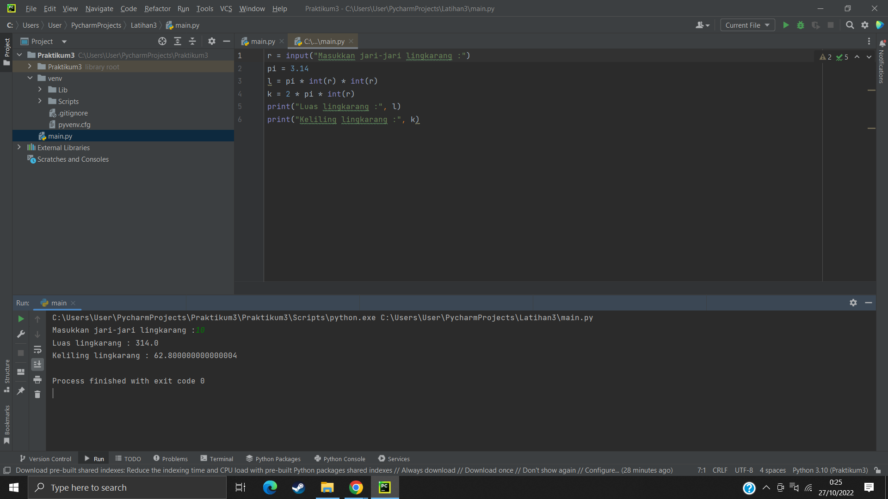
### Hasil praktikum 3 yang telah saya lakukan yaitu :
#### - Dapat memahami algoritma lingkarang yang diproses dalam Python
#### - Dapat menjelaskan bagaimana langkah-langkah membuat algoritma lingkaran pada Python
#### - Dapat membuat *Flowchart* algoritma dengan baik dan benar
#### - Dapat mengoperasikan langsung algoritma lingkarang pada Python
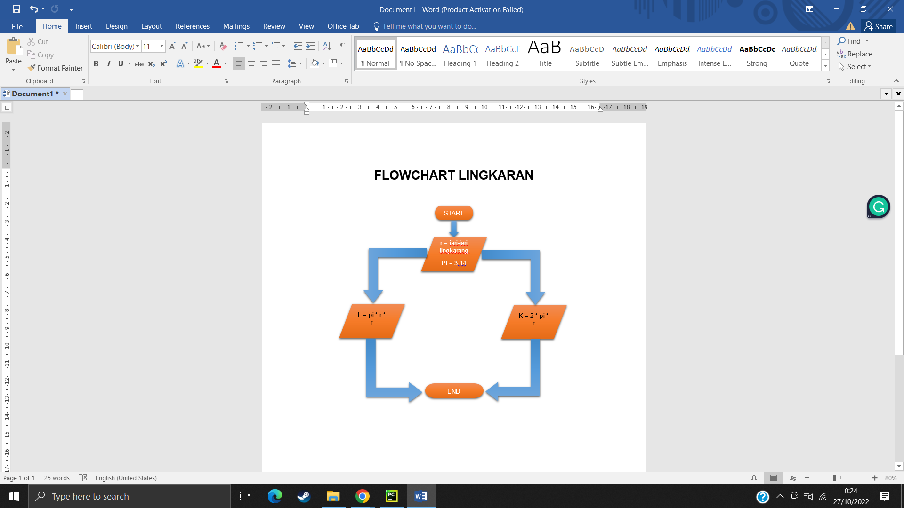
